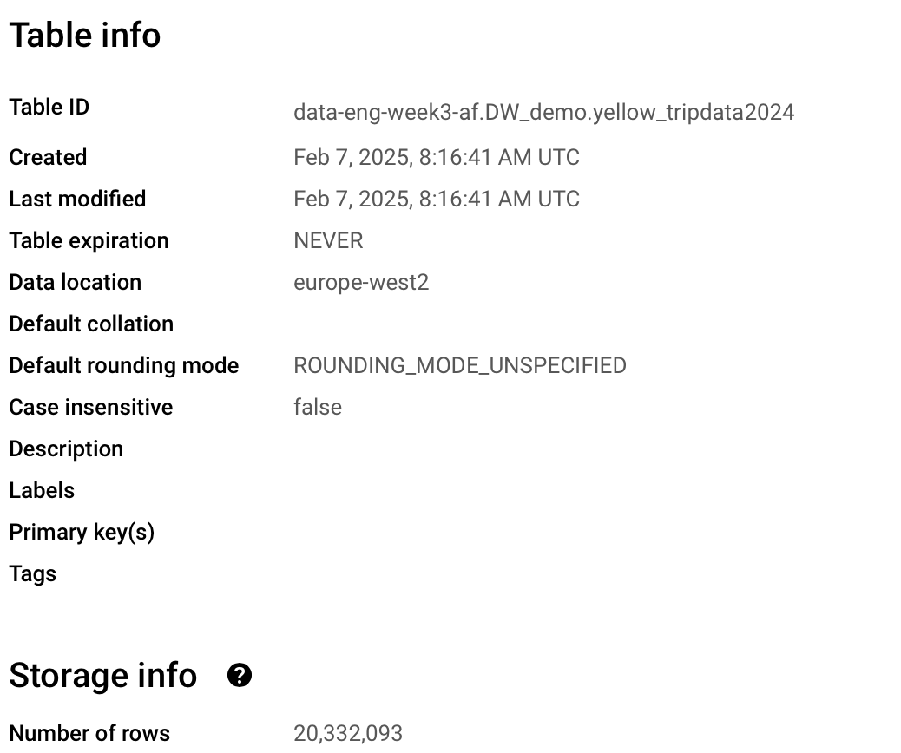

## Module 3 Homework
<b><u>Important Note:</b></u> <p> For this homework we will be using the Yellow Taxi Trip Records for **January 2024 - June 2024 NOT the entire year of data** 
Parquet Files from the New York
City Taxi Data found here: </br> https://www.nyc.gov/site/tlc/about/tlc-trip-record-data.page </br>
If you are using orchestration such as Kestra, Mage, Airflow or Prefect etc. do not load the data into Big Query using the orchestrator.</br> 
Stop with loading the files into a bucket. </br></br>

**Load Script:** You can manually download the parquet files and upload them to your GCS Bucket or you can use the linked script [here](./load_yellow_taxi_data.py):<br>
You will simply need to generate a Service Account with GCS Admin Priveleges or be authenticated with the Google SDK and update the bucket name in the script to the name of your bucket<br>
Nothing is fool proof so make sure that all 6 files show in your GCS Bucket before begining.</br><br>

<u>NOTE:</u> You will need to use the PARQUET option files when creating an External Table</br>

<b>BIG QUERY SETUP:</b></br>
Create an external table using the Yellow Taxi Trip Records. </br>

```
-- Creating external table referring to gcs path
CREATE OR REPLACE EXTERNAL TABLE `data-eng-week3-af.DW_demo.external_yellow_tripdata2024`
OPTIONS (
  format = 'PARQUET',
  uris = ['gs://data-eng-week3-af-terra-bucket-v2/yellow_tripdata_2024-*.parquet']
);
```

Create a (regular/materialized) table in BQ using the Yellow Taxi Trip Records (do not partition or cluster this table). </br>
```
-- Create a non partitioned table from external table
CREATE OR REPLACE TABLE `data-eng-week3-af.DW_demo.yellow_tripdata2024` AS
SELECT * FROM `data-eng-week3-af.DW_demo.external_yellow_tripdata2024`;
```

</p>

## Question 1:
Question 1: What is count of records for the 2024 Yellow Taxi Data?
**20,332,093**




## Question 2:
Write a query to count the distinct number of PULocationIDs for the entire dataset on both the tables.</br> 

```
-- external table
SELECT COUNT(1)
FROM
(SELECT DISTINCT(PULocationID)
FROM `data-eng-week3-af.DW_demo.external_yellow_tripdata2024`) AS t
; -- COUNT= 262, 0 MB

-- materialised table
SELECT COUNT(1)
FROM
(SELECT DISTINCT(PULocationID)
FROM `data-eng-week3-af.DW_demo.yellow_tripdata2024`) AS t
;-- COUNT= 262, 155.12 MB

```
What is the **estimated amount** of data that will be read when this query is executed on the External Table and the Table?

**0 MB for the External Table and 155.12 MB for the Materialized Table**


## Question 3:
Write a query to retrieve the PULocationID from the table (not the external table) in BigQuery. Now write a query to retrieve the PULocationID and DOLocationID on the same table. Why are the estimated number of Bytes different?

```
SELECT PULocationID
FROM `data-eng-week3-af.DW_demo.yellow_tripdata2024`; --122.12 MB

SELECT PULocationID,DOLocationID
FROM `data-eng-week3-af.DW_demo.yellow_tripdata2024`; --310.24 MB
```

**BigQuery is a columnar database, and it only scans the specific columns requested in the query. Querying two columns (PULocationID, DOLocationID) requires 
reading more data than querying one column (PULocationID), leading to a higher estimated number of bytes processed.**

## Question 4:
How many records have a fare_amount of 0?
- 128,210
- 546,578
- 20,188,016
- 8,333

## Question 5:
What is the best strategy to make an optimized table in Big Query if your query will always filter based on tpep_dropoff_datetime and order the results by VendorID (Create a new table with this strategy)
- Partition by tpep_dropoff_datetime and Cluster on VendorID
- Cluster on by tpep_dropoff_datetime and Cluster on VendorID
- Cluster on tpep_dropoff_datetime Partition by VendorID
- Partition by tpep_dropoff_datetime and Partition by VendorID


## Question 6:
Write a query to retrieve the distinct VendorIDs between tpep_dropoff_datetime
2024-03-01 and 2024-03-15 (inclusive)</br>

Use the materialized table you created earlier in your from clause and note the estimated bytes. Now change the table in the from clause to the partitioned table you created for question 5 and note the estimated bytes processed. What are these values? </br>

Choose the answer which most closely matches.</br> 

- 12.47 MB for non-partitioned table and 326.42 MB for the partitioned table
- 310.24 MB for non-partitioned table and 26.84 MB for the partitioned table
- 5.87 MB for non-partitioned table and 0 MB for the partitioned table
- 310.31 MB for non-partitioned table and 285.64 MB for the partitioned table


## Question 7: 
Where is the data stored in the External Table you created?

- Big Query
- Container Registry
- GCP Bucket
- Big Table

## Question 8:
It is best practice in Big Query to always cluster your data:
- True
- False


## (Bonus: Not worth points) Question 9:
No Points: Write a `SELECT count(*)` query FROM the materialized table you created. How many bytes does it estimate will be read? Why?


## Submitting the solutions

Form for submitting: https://courses.datatalks.club/de-zoomcamp-2025/homework/hw3